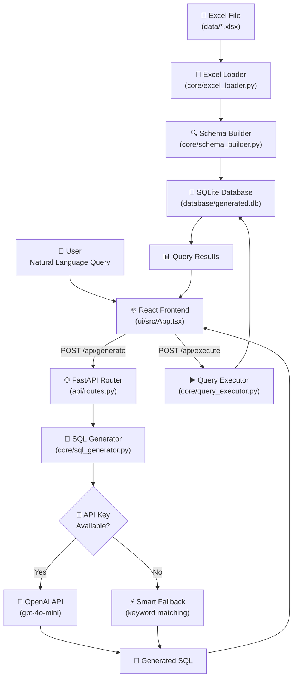
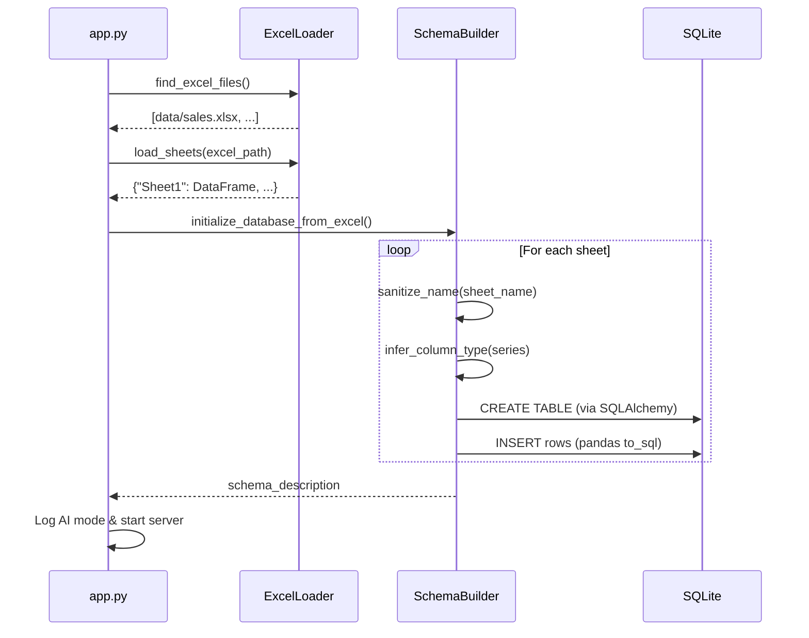
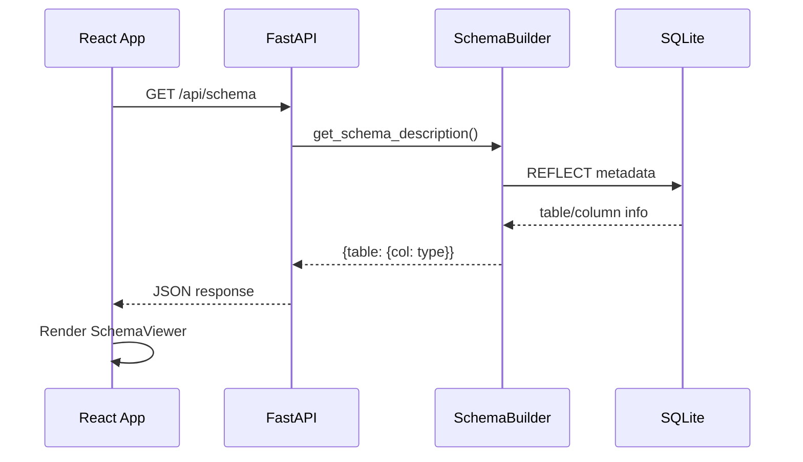
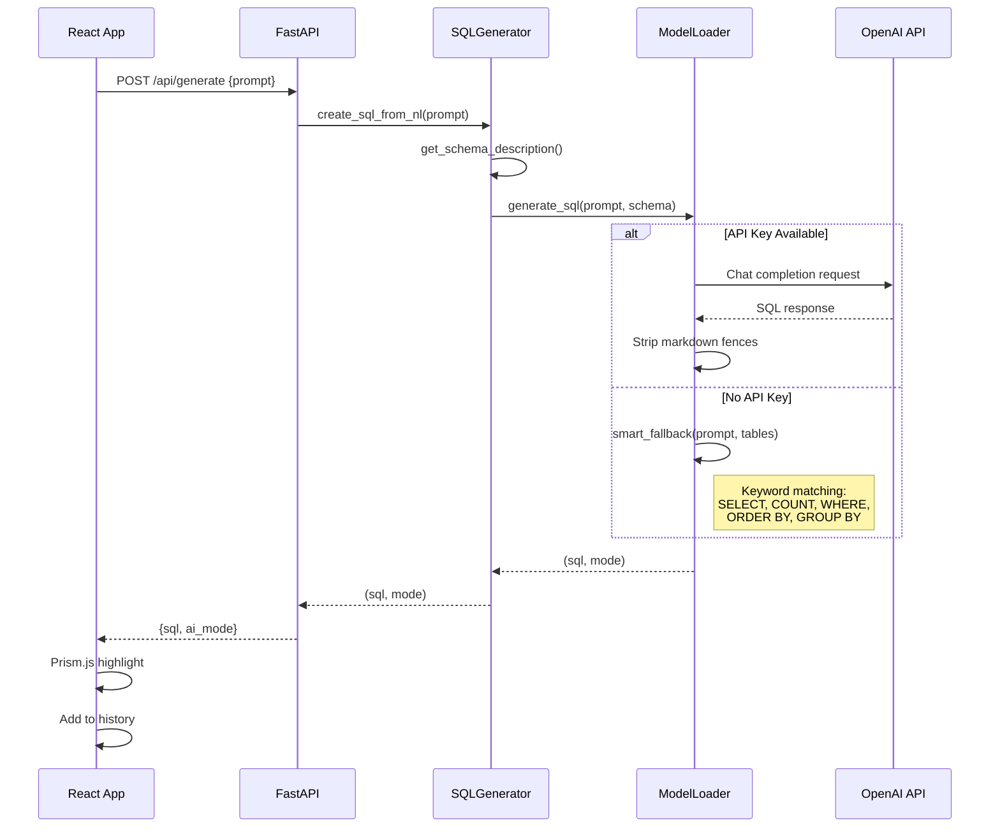
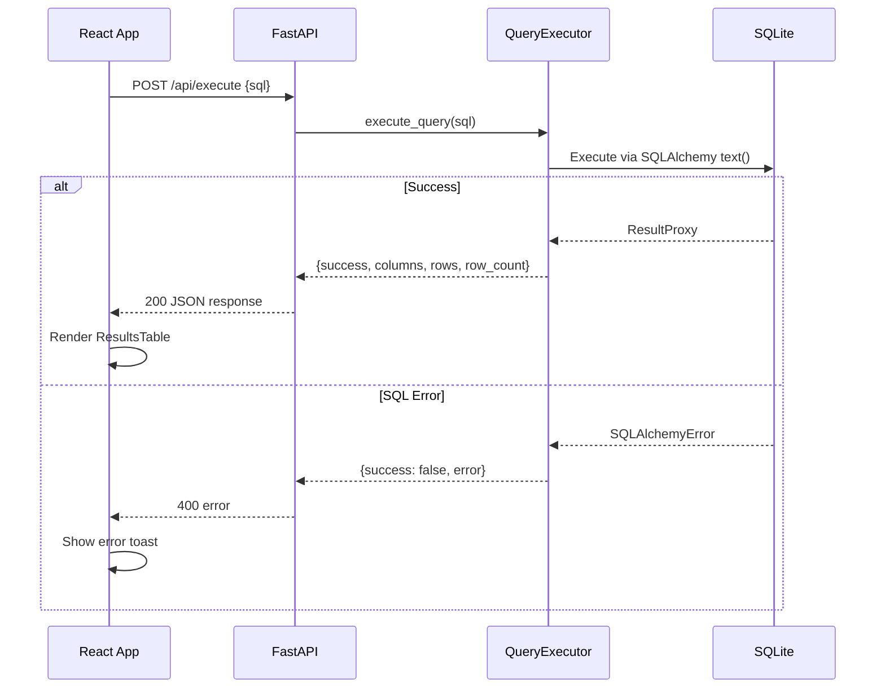
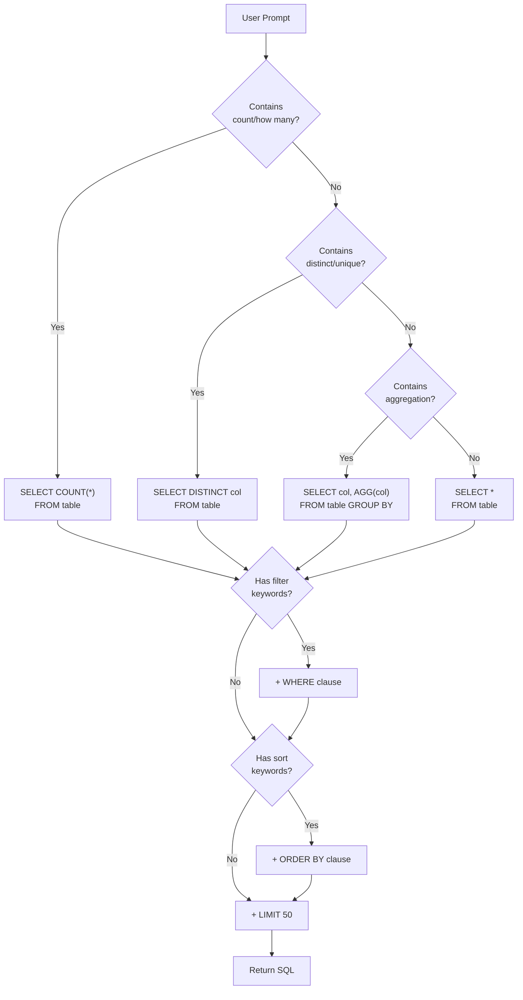

# Algorithmic Flow

This document describes the end-to-end data and control flow of the AI SQL Query Generator, from Excel ingestion through SQL generation and execution.

---

## High-Level Flow

---

## Detailed Step-by-Step Flow

### Phase 1: Startup & Data Ingestion

1. **`app.py`** lifespan handler calls `load_excel_data()` to find the primary Excel file.
2. **`excel_loader.py`** scans `data/` for `.xlsx` files, loads all sheets into DataFrames.
3. **`schema_builder.py`** iterates each sheet:
   - Sanitizes table/column names (lowercase, underscores, no special chars).
   - Infers SQLAlchemy column types from pandas dtypes.
   - Creates/replaces SQLite tables and bulk-inserts rows.
4. The schema is built and ready for queries.

### Phase 2: Schema Display

### Phase 3: SQL Generation

### Phase 4: Query Execution

---

## Smart Fallback Algorithm

When no OpenAI API key is configured, the system uses a keyword-based SQL generator:

The fallback detects these patterns:
- **COUNT**: "how many", "count", "total number"
- **DISTINCT**: "unique", "distinct", "different"
- **Aggregates**: "average", "sum", "maximum", "minimum"
- **Filters**: "where", "greater than", "less than", "equals"
- **Sorting**: "order by", "sort by", "highest", "lowest"
- **Grouping**: "group by", "per", "each", "by category"
