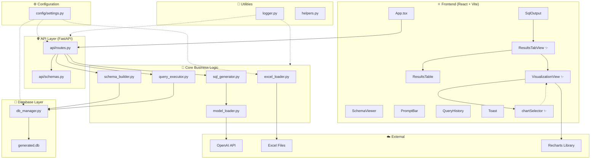

# Project Architecture

## Overview

The AI SQL Query Generator follows a **layered modular architecture** with clear separation of concerns. Each layer has a single responsibility and communicates through well-defined interfaces.

---

## Architecture Diagram



---

## Component Hierarchy

```
App.tsx
├── SchemaViewer (Left Panel)
├── SqlOutput (Right Panel)
│   ├── SQL Code Display
│   ├── Execute Button
│   └── ResultsTabView ✨ NEW
│       ├── Tab Navigation (Table | Visualization)
│       ├── ResultsTable (Table View)
│       │   ├── Column Headers (Sticky)
│       │   ├── Paginated Rows
│       │   └── Pagination Controls
│       └── VisualizationView ✨ NEW (Visualization Tab)
│           ├── Chart Selection Logic (chartSelector)
│           ├── Bar Chart
│           ├── Line Chart
│           ├── Pie Chart
│           ├── Area Chart
│           └── Scatter Plot
├── QueryHistory (Left Panel)
└── PromptBar (Bottom - Sticky)
```

---

## Directory Structure

```
projectt/
├── app.py                          # Application entry point & lifespan
├── requirements.txt                # Python dependencies
├── .env                            # Environment configuration
├── .gitignore                      # Git exclusions
├── run_backend.bat                 # Windows backend launcher
├── run_frontend.bat                # Windows frontend launcher
│
├── config/                         # ⚙️ Configuration
│   ├── __init__.py
│   └── settings.py                 # Pydantic BaseSettings
│
├── api/                            # 🌐 API Layer
│   ├── __init__.py
│   ├── routes.py                   # FastAPI endpoint definitions
│   └── schemas.py                  # Pydantic request/response models
│
├── core/                           # 🧠 Business Logic
│   ├── __init__.py
│   ├── excel_loader.py             # Excel file discovery & loading
│   ├── schema_builder.py           # Schema inference & SQLite creation
│   ├── sql_generator.py            # NL-to-SQL orchestration
│   ├── model_loader.py             # OpenAI integration & fallback
│   └── query_executor.py           # Safe SQL execution
│
├── database/                       # 💾 Database
│   ├── __init__.py
│   └── db_manager.py               # SQLAlchemy engine configuration
│
├── utils/                          # 🔧 Utilities
│   ├── __init__.py
│   ├── logger.py                   # Rotating file + console logging
│   └── helpers.py                  # Shared helper functions
│
├── ui/                             # ⚛️ React Frontend (Enhanced)
│   ├── package.json                # Updated: added recharts@^2.10.0
│   ├── vite.config.ts
│   ├── index.html
│   └── src/
│       ├── main.tsx                # React entry point
│       ├── App.tsx                 # Main application component
│       ├── styles.css              # Design system + 300+ new lines
│       ├── utils/
│       │   └── chartSelector.ts    # ✨ NEW: Intelligent chart selection
│       └── components/
│           ├── PromptBar.tsx       # NL input with auto-resize
│           ├── SchemaViewer.tsx    # Collapsible table explorer
│           ├── SqlOutput.tsx       # Enhanced: integrated ResultsTabView
│           ├── ResultsTabView.tsx  # ✨ NEW: Tab switching component
│           ├── ResultsTable.tsx    # Enhanced styling & layout
│           ├── VisualizationView.tsx # ✨ NEW: Chart rendering (Recharts)
│           ├── QueryHistory.tsx    # Session query log
│           └── Toast.tsx           # Notification system
│
├── tests/                          # 🧪 Test Suite
│   ├── __init__.py
│   ├── conftest.py                 # Shared fixtures
│   ├── test_api.py                 # API integration tests
│   ├── test_excel_loader.py        # Excel loader unit tests
│   └── test_schema_builder.py      # Schema builder tests
│
├── data/                           # 📂 Excel Data Files
│   └── *.xlsx                      # Drop Excel files here
│
├── documentation/                  # 📚 Documentation
│   ├── PROJECT_ARCHITECTURE.md     # This file (updated)
│   ├── TECHNICAL_DOCUMENTATION.md
│   ├── ALGORITHMIC_FLOW.md
│   ├── API_REFERENCE.md
│   └── UI_VISUALIZATION_SYSTEM.md  # ✨ NEW: Visualization docs
│
├── logs/                           # 📋 Log Files
│   └── app.log                     # Auto-rotating log
│
└── assets/                         # 🎨 Static Assets
```

---

### 1. Configuration Layer (`config/`)
Single source of truth for all settings. Uses Pydantic `BaseSettings` to load from environment variables and `.env` file with validation and type safety.

### 2. API Layer (`api/`)
Thin HTTP interface layer. Routes validate input via Pydantic schemas, delegate to core modules, and format responses. No business logic lives here.

### 3. Core Layer (`core/`)
All business logic: Excel discovery, schema inference, SQL generation (AI or fallback), and query execution. Modules are designed to be independent and testable.

### 4. Database Layer (`database/`)
SQLAlchemy engine creation and configuration. Provides a singleton `engine` used by the schema builder and query executor.

### 5. Utilities (`utils/`)
Cross-cutting concerns: logging with rotation and console output, shared helper functions like name sanitization.

### 6. Frontend (`ui/`)
React single-page application with a component-based architecture. All styling uses CSS custom properties for consistent theming. Components are focused and reusable.

### 7. Tests (`tests/`)
Pytest-based test suite with shared fixtures. Covers unit tests (type inference, name sanitization, data loading) and integration tests (all API endpoints via TestClient).

---

## Data Flow Summary

| Step | Component | Input | Output |
|------|-----------|-------|--------|
| 1 | `excel_loader` | `.xlsx` files | `dict[str, DataFrame]` |
| 2 | `schema_builder` | DataFrames | SQLite tables + schema dict |
| 3 | `sql_generator` | NL prompt + schema | SQL string + mode |
| 4 | `query_executor` | SQL string | Result rows + columns |
| 5 | `routes.py` | HTTP requests | JSON responses |
| 6 | `App.tsx` | JSON responses | Rendered UI |

---

## Design Decisions

1. **Pydantic Settings** over `os.getenv()` — type safety, validation, and single source of truth.
2. **SQLAlchemy** over raw `sqlite3` — ORM flexibility, connection pooling, and cross-database portability.
3. **Smart fallback** alongside OpenAI — ensures the app works without an API key for demo/portfolio purposes.
4. **CSS Custom Properties** over utility classes — maximum control and maintainability without framework lock-in.
5. **Session-based history** over persistence — keeps the app stateless and simple for a portfolio project.
